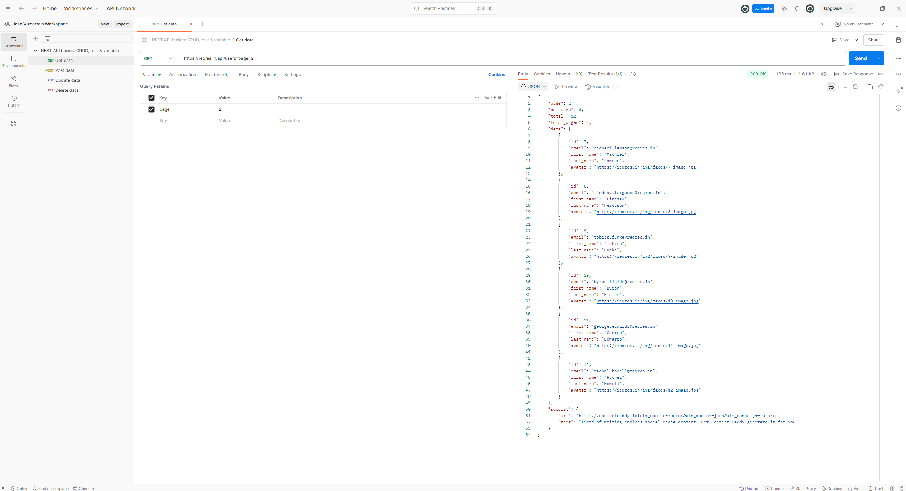
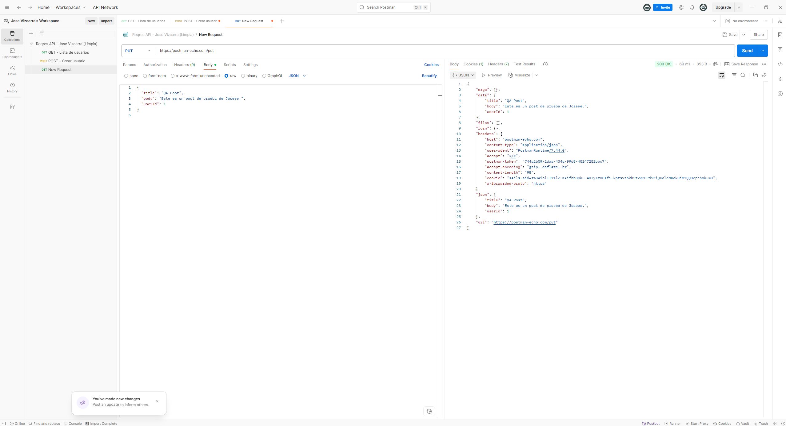

# Pruebas de API con Postman - Jose Vizcarra

Este repositorio contiene pruebas básicas de API realizadas con Postman usando el sitio público [reqres.in](https://reqres.in).
Este es un pequeño proyecto personal para demostrar mis habilidades como QA Tester Manual, utilizando Postman para hacer pruebas de APIs públicas, y GitHub para documentar el proceso.

[📎 Ver mi CV en PDF](./CV_Jose_Alfredo_QA_Junior.pdf)

---

## 🧪 Herramientas utilizadas:
- Postman
- Git & GitHub

---

## 📋 Pruebas realizadas:

### ✅ 1. Prueba GET – Lista de usuarios
- **Endpoint:** `https://reqres.in/api/users?page=2`
- **Resultado esperado:** Código 200 OK
- ✅ Se obtuvo correctamente el listado de usuarios

📸 Captura de pantalla:


---

### ✅ 2. Prueba POST – Crear nuevo usuario
- **Endpoint:** `https://reqres.in/api/users`
- **Método:** `POST`
- **Body enviado (JSON):**

📸 Captura de pantalla:


```json
{
  "name": "Jose",
  "job": "QA Tester"
}
